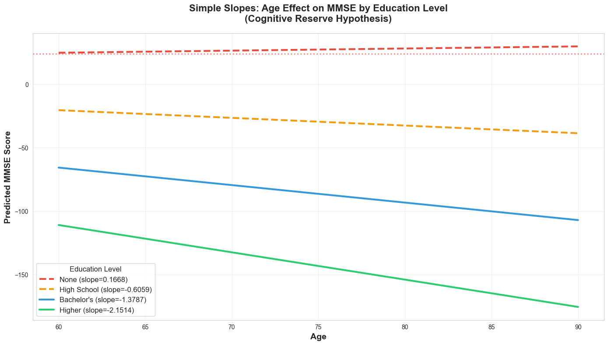

# Cognitive Reserve in Alzheimer’s Disease: A Data-Driven Exploration

Author: Michael Koo  
Repository: CognitiveReserve

---

## Abstract

Cognitive reserve (CR) refers to the brain’s resilience to neuropathology. Individuals with higher CR can maintain better cognitive performance despite similar levels of brain pathology. In this project, I combine a brief literature review with an exploratory and modeling-driven analysis of an Alzheimer’s disease (AD) dataset to: (1) operationalize cognitive reserve using measurable proxies, (2) explore cohort structure and group differences, and (3) prototype predictive models that relate demographics, clinical measures, and lifestyle factors to cognition. The result is a transparent, reproducible pipeline with clean visuals designed for an applied data science portfolio.

## Highlights at a glance

- End-to-end, reproducible notebook: data loading, cleaning, EDA, feature engineering, modeling, and visualization
- Interpretable visuals tailored for both technical and general audiences
- Literature-informed framing: connects empirical analysis to cognitive reserve theory
- Clear limitations and next steps, emphasizing scientific rigor and room for improvement

---

## Visual preview

Below are curated figures exported from the notebook. See the full analysis in `cognitive_reserve_analysis.ipynb`.

<p align="center">
   
   <br/>
   <em>Figure 1. Project overview visual exported from the notebook.</em>
</p>

<p align="center">
   
   
   <br/>
   <em>Figure 2–3. Left: Distribution of key variables (Age, MMSE, Education, Diagnosis, ADL, Functional Assessment). Right: Correlation matrix showing generally weak relationships with MMSE.</em>
</p>

<p align="center">
   
   
   <br/>
   <em>Figure 4–5. Left: Age–MMSE patterns by education level (scatter + trend lines, plus grouped distributions). Right: Alzheimer’s diagnosis rates by age and education (line + heatmap).</em>
</p>

<p align="center">
   
   
   <br/>
   <em>Figure 6–7. Left: Linear regression diagnostics for the MMSE model. Right: Simple slopes visualization of Age × Education effects on MMSE.</em>
</p>

> Tip: To refresh figures after notebook edits, export via `jupyter nbconvert --to markdown cognitive_reserve_analysis.ipynb --output tmp_nb`, then copy preferred images from `tmp_nb_files/` to `figures/` (overwriting the files above as needed).

---

## Background and motivation

- Cognitive reserve (CR) is a theoretical construct explaining why some individuals show better-than-expected cognition given similar brain pathology.
- In AD research, CR proxies include education, occupational complexity, baseline IQ, language/literacy measures, and cognitively stimulating activities.
- Empirically, CR often moderates the relationship between pathology (or risk factors) and cognitive outcomes.

For a quick survey of the literature informing this project, see `litReview.md`.

## Data

- This repository does NOT include the raw dataset to keep the repo lightweight and respect data hosting policies.
- Download the data from Kaggle: https://www.kaggle.com/datasets/rabieelkharoua/alzheimers-disease-dataset
- After downloading, place the CSV at the project root as `alzheimers_disease_data.csv` (or adjust the path in the notebook).
- Typical variables include demographics (age, sex), clinical assessments (cognitive scores), and lifestyle/education factors used as CR proxies.
- Targets/outcomes: cognition-related measures (e.g., composite scores or task-specific outcomes).

Assumptions: Since CR is latent, this analysis uses practical proxies (e.g., years of education, occupational/lifestyle indicators) to approximate reserve; the exact choices are documented and justified inline in the notebook.

## Methods

1. Data hygiene and exploratory analysis
   - Missingness profiling, simple imputation strategies, and outlier checks
   - Distributional EDA (histograms, KDEs, box/violin plots) and bivariate relationships
   - Correlation heatmaps and pairwise diagnostics

2. Cognitive reserve proxy construction
   - Engineering CR proxy variables using education and related measures
   - Optional scaling/normalization to align units
   - Sensitivity checks with alternative proxy specifications

3. Modeling
   - Baseline linear/regularized regressions and/or tree-based models to predict cognition
   - Cross-validation with robust metrics (e.g., MAE/RMSE for regression; ROC-AUC if classification)
   - Model diagnostics and interpretability (e.g., feature importance, partial dependence)

4. Communication
   - Clean plots designed for general audiences
   - Clear captions and callouts that tie results back to CR theory

## Results (selected)

- Cohort structure and distributions provide context for interpreting CR proxies
- Associations between CR proxies and cognitive outcomes are visualized and summarized
- Prototype models reveal which features (including CR proxies) are most predictive of cognition
- Diagnostics suggest where models generalize well and where they struggle

Refer to the notebook for exact numeric results, confidence intervals, and additional plots.

## Interpretation and discussion

- The observed patterns are consistent with CR theory: proxies like education often relate positively to cognitive outcomes and can buffer risk factors
- Effect sizes and stability depend on variable quality, measurement error, and cohort composition
- Causality is not implied; results are observational and exploratory

## Limitations

- CR is latent and multi-dimensional; proxies are imperfect
- Potential confounders and cohort biases (selection, survival) may influence results
- Sample size and measurement granularity constrain model complexity and generalizability
- External validity not established; prospective validation is a natural next step

## Future work

- Expand proxy set (occupational complexity, bilingualism, cognitive engagement indices)
- Incorporate longitudinal data to examine trajectories and CR moderation over time
- Use causal inference or structural modeling to probe mechanisms
- Validate findings across multiple datasets/cohorts

## Reproducibility

- Primary analysis is in `cognitive_reserve_analysis.ipynb`
- Data file: `alzheimers_disease_data.csv` (download separately from Kaggle; see Data section)
- To regenerate the visual assets embedded above, export the notebook to Markdown (creates `tmp_nb.md` + `tmp_nb_files/`):

```bash
jupyter nbconvert --to markdown cognitive_reserve_analysis.ipynb --output tmp_nb
```

- Optional: export to PDF for sharing:

```bash
jupyter nbconvert --to pdf cognitive_reserve_analysis.ipynb
```

Figures are curated in `figures/`. To refresh curated images after exporting to Markdown, copy the generated files:

```bash
cp tmp_nb_files/tmp_nb_11_0.png figures/eda_distributions.png
cp tmp_nb_files/tmp_nb_14_1.png figures/correlation_heatmap.png
cp tmp_nb_files/tmp_nb_17_0.png figures/age_mmse_by_education.png
cp tmp_nb_files/tmp_nb_18_0.png figures/diagnosis_rate_by_age_education.png
cp tmp_nb_files/tmp_nb_23_0.png figures/mmse_regression_diagnostics.png
cp tmp_nb_files/tmp_nb_34_0.png figures/simple_slopes_age_mmse_education.png
```

## How to run

1. Create and activate a virtual environment (macOS/Linux):
   ```bash
   python -m venv .venv
   source .venv/bin/activate
   pip install -r requirements.txt
   ```
2. Launch Jupyter and open the notebook:
   ```bash
   jupyter lab  # or: jupyter notebook
   ```
3. Run all cells to reproduce the figures and results.

If you placed the CSV somewhere else, update the data loading path in the notebook accordingly.

> Note: From the terminal output in this repo, `seaborn` is already installed; PDF export has also been tested via `nbconvert`.

## References

- Stern Y. Cognitive Reserve. Neuropsychologia. 2009.
- Stern Y, et al. Whitepaper: Cognitive reserve, brain reserve, and brain maintenance. Nat Rev Neurol. 2020.
- Optional additional sources: see `litReview.md`.

---

Curated and analyzed by Michael Koo. Feedback and collaboration are welcome.